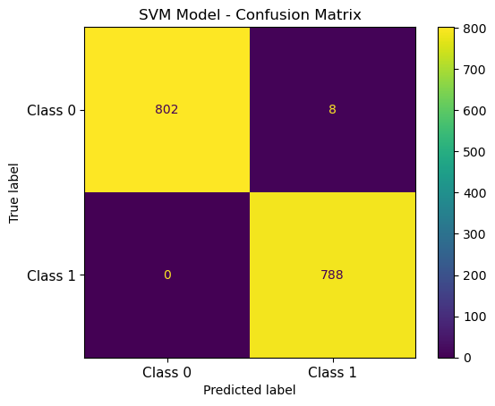
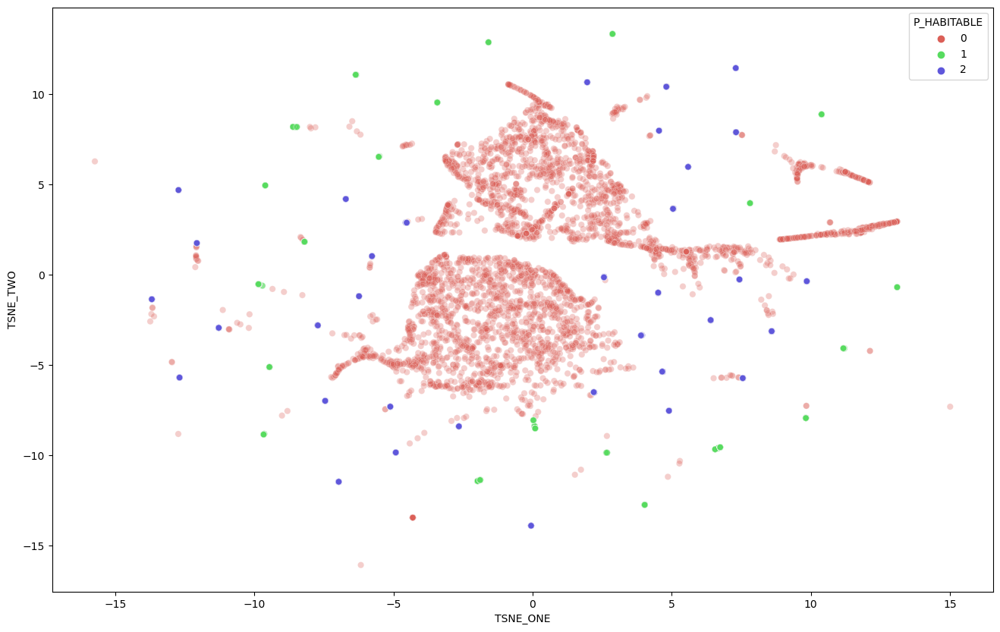
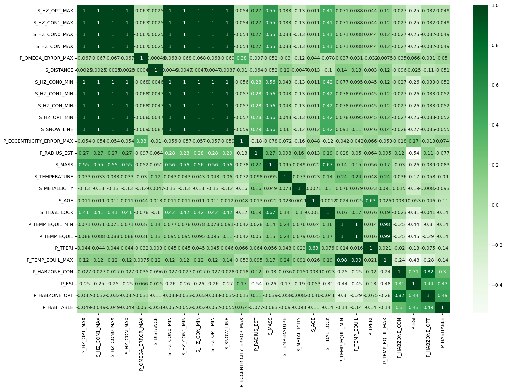
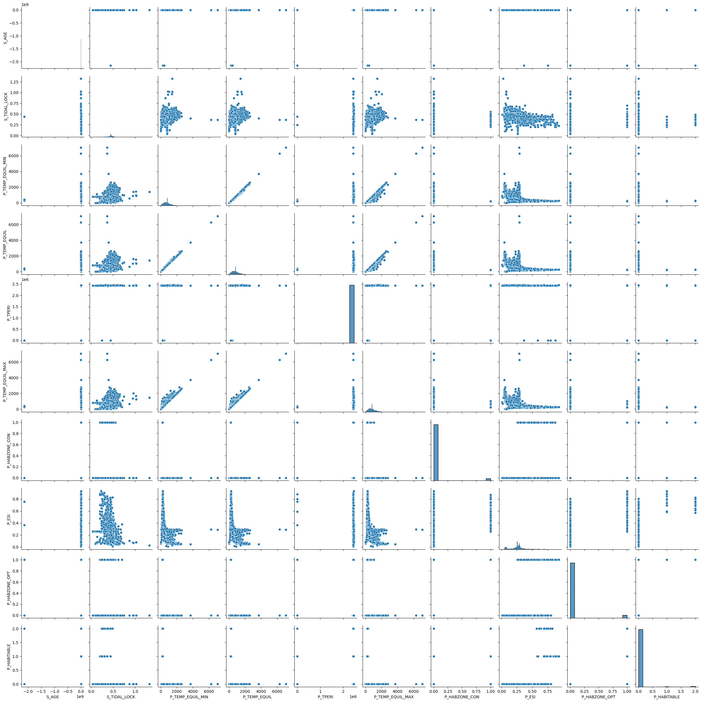
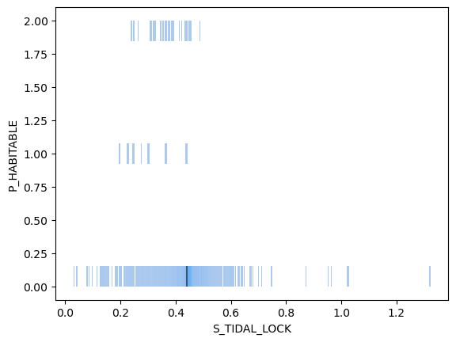

#  Predicting Habitability Using The PHL Exoplanet Catalog
**Benjamin Prentice, Noah Psutka** 

* [Dataset](https://www.kaggle.com/datasets/chandrimad31/phl-exoplanet-catalog) 

## Project Summary

# ADD HERE

<Complete for [Project Submission](https://canvas.txstate.edu/courses/1993336/assignments/27480566) assignment submission. See github.com repositories on how people shortblurb thre project e.g. REMOVE: It is a standalone section. It is written to give the reader a summary of your work. Be sure to specific, yet brief. Write this paragraph last (150-300 words)

<Fully rewrite the summary as the last step for the [Project Submission](https://canvas.txstate.edu/courses/1993336/assignments/27480566)>

## Problem Statement

* We will be using a binary classification prediction model. The
class label we will predict will be in regards to the habitability of a planet;
not-habitable = 0, habitable = 1

* Typical algorithms used for binary classification are KNN, Logistic Regression,
SVM's and Decision Trees. These will be the benchmarks used to determine the output
class labels.
Imbalanced (Binary) Classification: Many of our data points for habitability belong
to the non-habitable label; Therefore we will be using cost-sensitive versions of
logistic regression, SVM's and Decision Trees.
* Data comes from kaggle, the link to the dataset is provide at top of this page.
Success measures will be Precision, Recall, and the F-Measure
Recall will be one of the most important measures for our model because we do not wish
to mislabel a habitable planet as inhabitable.
We will not be using "accuracy" as a performance metric as it can be misleading in
imbalanced binary tasks.
* This project was created in hopes of creating a model that can predict what
features are the strongest predictors for a planet to be habitable. This information
can be used to narrow the search of stars for habitable planets.

## Dataset
    
* Description: Prior to preprocessing dataset, the dataframe size is (4048, 112). We narrowed down the dataset to only contain columns/variables that were relevant to our problem.
    
* Some notable features are:
    
     * S_METALLICITY - abundance of elements present in the planet that are heavier than hydrogen and helium
     * S_AGE - age of the planet 
     * S_TIDAL_LOCK - situation in which an astronomical object's orbital period matches its rotational period
     * P_TEMP_EQUIL_MIN - minimum temperature estimated in degrees Kelvin
     * P_TEMP_EQUIL - average temperature estimated in degrees Kelvin
     * P_TPERI - time of passage at the periapse for eccentric orbits
     * P_TEMP_EQUIL_MAX - maximum temperature estimated in degrees Kelvin
     * P_HABZONE_CON - not in the habitable zone of a star ( binary classification )
     * P_ESI - Earth Similarity Index, a measure of similarity to Earth's stellar flux, and mass or radius (Earth=1.0)
     * P_HABZONE_OPT - in the habitable zone of a star ( binary classification )
    
* Benchmarks:
    We are evaluating other published models to use as benchmarks. None has been chosen yet. Another benchmark used was our intitial model.

* Processing Tools Used: 
    
     * Scikit-Learn - cross_val_score, TSNE, PCA, StandardScaler, ConfusionMatrixDisplay, LabelEncoder, train_test_split
    
     
     
     
     * Seaborn - heatmap, pairplot, histplot, scatterplot

     
     
     
     
     * Pandas - read_csv, dataframe
     * Numpy
     * Matplotlib - hist, plot formatting
     * Imblearn - RandomOverSampler
     
     

## Exploratory Data Analysis 

* EDA graphs - 
    
    We plan on using pairplots, histograms, confusion matrices, and heatmaps. Other EDA graphs will likely be very useful.
    
* Why? - 
    
    * Pairplots can help us visualize the correlation between each feature.
    * Histograms can give us a closer look at this data.
    * Confusion matrices can help us to evaluate the accuracy of a model.
    * Heatmaps help us see correlation between features.
    
* The alogrithms we used for data preprocessing were StandardScaler and RandomOversampler.
 
  
  
  
  
  
* StandardScaler was used because it seemed the most widely used way to scale features. Normalization was attempted but with little change to our results.

## Data Preprocessing 

* We used Standard Scaler to scale our dataset. We also eliminated features that had very high correlation with each other. 
  
* We considered using Decision Trees and KNN but did not use them in the end. Our logistic regression and SVM models were sufficient. 

## Machine Learning Approaches

* What is your baseline evaluation setup? Why? 
    
    We will test different models and log any improvement with each. We have already seen marked improvement by using different techniques, such as random oversampling.
    
* Describe the ML methods that you consider using and what is the reason for their choice? 
   * What is the family of machine learning algorithms you are using and why?
    
    We will be using classification algorithms, because our target is a binary classification. We plan on trying logistic regression, support vector machines, decision trees, and K-nearest neighbors algorithms.
    
# ADD HERE

<Expand and complete for [Project Submission](https://canvas.txstate.edu/courses/1993336/assignments/27480566)>

* Describe the methods/datasets (you can have unscaled, selected, scaled version, multiple data frames) that you ended up using for modeling. 

   We used the PHL Exoplanet Catalog. Features used are:  
    
   P_OMEGA_ERROR_MA, S_DISTANCE, S_SNOW_LINE, P_ECCENTRICITY_ERROR_MAX, P_RADIUS_EST, S_MASS, S_TEMPERATURE, S_METALLICITY, S_AGE,  S_TIDAL_LOCK, P_TEMP_EQUIL, P_TPERI, P_HABZONE_CON, P_ESI, P_HABZONE_OPT
    
   These features were scaled using Standard Scaler. 

* Justify the selection of machine learning tools you have used
  * How they informed the next steps? 
  
  We used a correlation matrix to determine the features that were heavily correlated with each other. This allowed us to drop features that would have skewed the results. 
  We used Label Encoder to determine if there was any correlation between habitability and the feature columns that contained objects.
  We used a pairplot to visualize the relationship between features and habitability.
  We used confusion matrices which led us to combine classes 1 & 2.

# ADD HERE
* Make sure to include at least twp models: (1) baseline model, and (2) improvement model(s).  
   * The baseline model is typically the simplest model that's applicable to that data problem, something we have learned in the class. 
   * Our baseline models use logistic regression and SVMs.
   * Improvement model(s) are available on Kaggle challenge site, and you can research github.com and papers with code for approaches.  
   * Improvement models could include XGBoost and machine learning methods for replacing null values.

## Experiments 

# ADD HERE

<Complete for the [Project Submission](https://canvas.txstate.edu/courses/1993336/assignments/27480566)>

This section should only contain final version of the experiments. Please use visualizations whenever possible.
* Describe how did you evaluate your solution 
  * What evaluation metrics did you use? 
* Describe a baseline model. 
  * How much did your model outperform the baseline?  
* Were there other models evaluated on the same dataset(s)? 
  * How did your model do in comparison to theirs? 
  * Show graphs/tables with results 
  * Present error analysis and suggestions for future improvement. 

## Conclusion

# ADD HERE

<Complete for the [Project Submission](https://canvas.txstate.edu/courses/1993336/assignments/27480566)>

* What did not work? 
* What do you think why? 
* What were approaches, tuning model parameters you have tried? 
* What features worked well and what didn't? 
* When describing methods that didn't work, make clear how they failed and any evaluation metrics you used to decide so. 
* How was that a data-driven decision? Be consise, all details can be left in .ipynb

 
 **Submission Format** 
 
1. Python code with markdown documentation, images saved in .jpg or .png format, and README.md as a project report
2. Jupyter notebook (.ipynb) that contains full markdown sections as listed above 

## Now go back and write the summary at the top of the page
